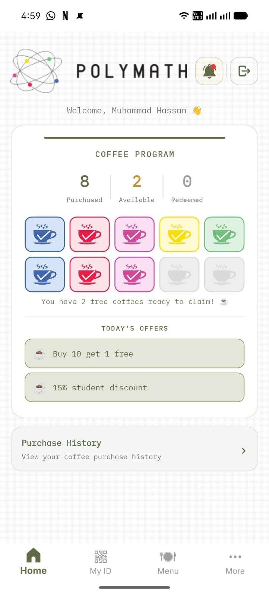
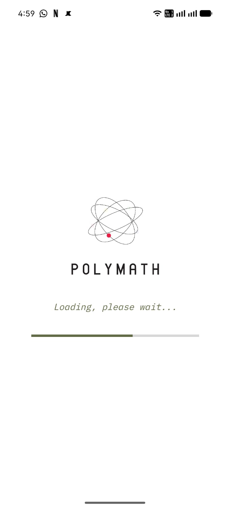
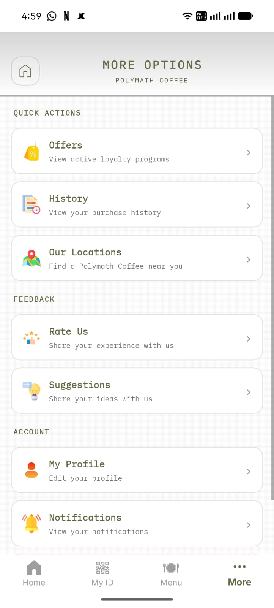

# FREDLoyalty App

A customer-facing loyalty app for **Polymath Coffee**, part of a multi-branch restaurant group — built with .NET MAUI for Android and iOS, backed by an ASP.NET Core Web API.

📱 **Live on both stores:**
- [Google Play Store](https://play.google.com/store/apps/details?id=com.fredthecompany.polymathcoffee) — published
- [Apple App Store](https://apps.apple.com/pk/app/polymath-coffee/id6774607089) — published

## Screenshots

| Home — Loyalty Card | Splash Screen | More Options |
|---|---|---|
|  |  |  |

## Features
- Native Sign in with Google and Sign in with Apple (PKCE OAuth flow, no client secret on-device)
- Coffee loyalty card with purchase tracking, free-coffee redemption, and reward progress
- QR-code member ID for in-store scanning
- Push notifications via Firebase Cloud Messaging, with scheduled background jobs for loyalty/purchase alerts
- Branch locator with Google Maps integration
- Profile photo capture/upload with on-device image cropping (SkiaSharp)
- Ratings and suggestions feedback flow

## Architecture
- **Mobile**: .NET MAUI (MVVM), single codebase targeting Android + iOS
- **Backend**: ASP.NET Core Web API, JWT-based authentication
- **Auth**: Platform-native Apple/Google sign-in, PKCE for OAuth, tokens stored via platform Keychain/Keystore

## Note on this repository
This is a sanitized portfolio version of a production app currently live on both app stores. API endpoints, OAuth client IDs, Firebase configuration, Maps API keys, and brand assets have been replaced with placeholders or removed entirely — see `google-services.json` note below and `ApiEndpoints.cs` for expected configuration shape.

Android builds require your own `google-services.json` from Firebase Console (not included for security reasons).
